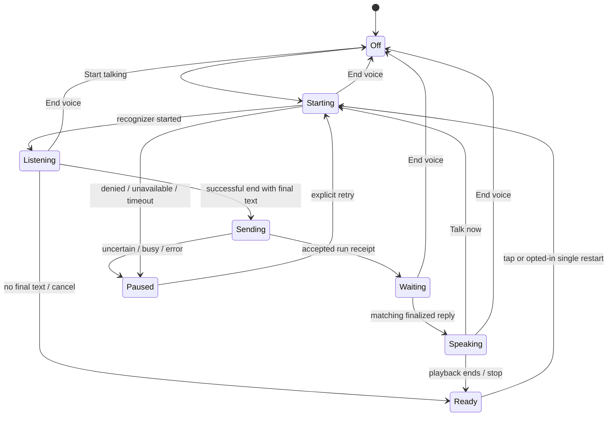

# Leam voice architecture — implementation handoff

This contract records the architecture and successive voice increments. Later sections describe the current shared composer, device preferences and app-wide streamed playback. Earlier design stages are not separate claims of deployed behavior. Actual device/provider acceptance remains installation-specific; see the test coverage guide.

## Decision

Build a foreground, half-duplex voice surface in the Leam PWA. Browser recognition produces ordinary companion text; the existing authenticated, durable companion submission path executes it; browser speech synthesis reads the matching completed answer. Keep speech transport separate from the companion model and domain operations.

Ship a small usable dictation/read-aloud increment first, then complete the voice conversation loop with correlated replies and an optional next-turn listening attempt. This sequence is implementation staging, not a claim that dictation alone fulfills natural voice conversation. The product should always expose the complete text transcript, the current microphone/playback state, and a direct way to stop.

Web Speech is the initial adapter, not the application architecture. It can deliver useful voice turns without new provider accounts. It does not provide dependable full-duplex interruption, portable offline recognition, model-independent speech quality, or background conversation. Replacing STT/TTS later should leave conversations, model settings, permissions, and domain approvals intact.

## Current seams and the useful existing contract

| Surface | Current behavior | Voice integration |
|---|---|---|
| `apps/web/src/companion.tsx:393` | Companion selection/history/composer; serial polling every two seconds | Render voice controls and use one extracted submission function for typed and spoken text |
| Composer `onSubmit` in that file | Saves immutable `{thread,text,id}` in sessionStorage before POST; same ID retries uncertainty | Preserve this guarantee; voice must never manufacture a second ID when the same send fails |
| `leam_api/companion.py:send` | Stores exact contextual payload and returns the runtime receipt | No new audio route needed for initial browser speech |
| Runtime `RebornSubmitTurnResponse` | `submitted` / `already_submitted` contain `run_id`; busy outcomes differ | Validate outcome and save the accepted run identity for this voice turn |
| Runtime `ThreadMessageRecord` | `message_id`, `thread_id`, `turn_run_id`, `kind`, `status`, `content` | Speak only an `assistant` message with `status: finalized` and the matching run |
| `ModelSettings` | Persists companion model/reasoning separately from coding | Voice uses the same selected companion model and reasoning; never silently selects a faster/billed model |
| ProposalList and companion domain contract | Suggestions require explicit UI review/approval | Speech supplies conversational text only; a spoken “yes” does not approve a proposal |
| `public/sw.js` | Public shell cache only; API data excluded | No speech/audio/transcript caching or background microphone work |

Runtime source references: `crates/contracts/ironclaw_product_contracts/src/product_wire.rs` (`RebornSubmitTurnResponse`), `crates/domains/ironclaw_threads/src/contract.rs` (`ThreadMessageRecord`, `MessageStatus`), and `crates/product/ironclaw_webui/src/webui_v2/handlers.rs` (`session_channel_message`, `get_timeline`). Leam currently ignores the submission receipt in its UI; automatic speech must retain it. Existing Python test fixtures sometimes return only `{accepted: true}`. That is inadequate as the sole voice receipt fixture; use the actual pinned runtime shape.

Do not infer a reply from “latest assistant message,” a changed array length, timestamps, or text equality. Those approaches read historical, unrelated, partial, or other-client answers aloud.

## MVP interaction

1. **Dictate** beside the text composer starts one capture from a real tap/click/key activation. Live draft text appears as provisional. **Finish dictation** stops capture and places final recognized text into the editable composer; existing Send submits it. **Cancel dictation** discards the new capture, preserving any pre-existing typed draft. Editing the composer during capture first stops/invalidates that capture so late results cannot overwrite user edits.
2. **Voice conversation** opens a compact mobile panel within the selected companion conversation. Show the conversation title and active companion model. Its start screen says that completed speech turns are sent to Leam, replies are read aloud, and the browser may use a remote speech service. **Start talking** begins the first turn. If there is no selected conversation, let the existing New conversation flow establish one before requesting microphone access.
3. In conversation mode, a successful recognition end with nonempty final text commits one message automatically. Show the recognized turn immediately and “Leam is thinking” after accepted submission. A visible **Finish speaking** allows the user to end a long turn; **Cancel this recording** prevents submission. End-of-turn timing belongs primarily to the recognizer, not an invented universal silence threshold.
4. Read the associated final assistant answer. During playback show **Stop speaking**, **Talk now**, and **End voice**. Talk now cancels playback and attempts a fresh recognition start from that same trusted gesture. This is tap-to-interrupt; the microphone is off while Leam speaks, so speaking over Leam is not a supported interruption mechanism yet.
5. After speech ends, show **Your turn — tap to speak** by default. An explicit **Keep listening between turns** setting may try one automatic restart after a successful turn on devices that tolerate it. If it fails, stalls, or prompts unexpectedly, return to the visible tap control. Do not claim persistent hands-free support before device testing. Never retry in an unbounded `onend -> start` loop.
6. **End voice** cancels capture, pending playback, timers and future auto-play/listening. It does not cancel or undo an already sent companion turn. A response still arrives in text. Do not label this control “Stop task”; runtime cancellation is a separate future product operation.

Dictation is the correction-friendly path; conversation mode is the natural auto-send path, explicitly selected for that purpose. Recognizer errors, suspension, permission loss and ambiguous delivery pause the conversation instead of auto-submitting an uncertain partial utterance.

No special spoken control words in the MVP. “Stop,” “approve,” or “delete” in recognized text remains ordinary conversation content. This avoids accidental control activation and preserves the existing approval boundary. The user can always use visible controls.

## Browser facts and policy consequences

Web Speech separates recognition and synthesis. Recognition supports final/interim results; `continuous` controls multiple results, not a guarantee of an indefinitely open session. `stop()` attempts a final result; `abort()` discards recognition. Local recognition requires the explicit `processLocally` capability; its default does not promise locality. Synthesis voices may be local or remote, available voices can arrive asynchronously, and cancellation clears queued speech. These are API contracts, not proof of uniform browser implementation. [Web Speech API draft, checked 2026-09-20](https://webaudio.github.io/web-speech-api/)

| Platform boundary | Evidence | Leam policy |
|---|---|---|
| Safari/iOS recognition | WebKit introduced Safari recognition using its Siri engine and documented Siri enablement as a prerequisite | Detect the constructor and then actual start/results/errors; provide actionable settings help only for the observed failure. [WebKit release documentation](https://webkit.org/blog/11648/new-webkit-features-in-safari-14-1/) |
| Installed iOS PWA vs Safari tab | WebKit historically documented a Home Screen limitation; that issue is resolved **LATER**, not evidence of a present universal rule | Test installed and tab modes separately; offer opening the same conversation in Safari when installed-mode recognition fails. [WebKit 225298](https://bugs.webkit.org/show_bug.cgi?id=225298) |
| iOS media lifecycle | An August 2026 open report describes recognition hanging after audio/video playback on one iPhone/iOS 26.6 combination, including PWA mode; broader impact is unconfirmed | Include silent-stall timeouts and second/third-turn device tests. Do not present the report as a confirmed defect on every iPhone or specifically in speechSynthesis. [WebKit 321436](https://bugs.webkit.org/show_bug.cgi?id=321436) |
| Embedded browsers | An older resolved WebKit issue shows that an exposed constructor can still fail because the host app lacks speech permission configuration | Constructor present means “can attempt,” not “working.” Never claim every iOS browser behaves identically. [WebKit 239816, RESOLVED WORKSFORME](https://bugs.webkit.org/show_bug.cgi?id=239816) |
| Chrome speech output | Chrome documents a user-activation requirement for `speechSynthesis.speak()` | Begin from a visible user action, handle `not-allowed`, and offer **Play reply** when automatic playback is blocked. Do not use synthetic clicks or silent-audio unlock hacks. [Chrome developer documentation](https://developer.chrome.com/blog/chrome-71-deps-rems) |
| On-device recognition | Chromium's May 2026 discussion says on-device recognition had launched but Android/ChromeOS lacked it at that time. Current Edge docs describe an on-device feature behind Canary/Dev flags | Probe optional local support, never treat desktop support as mobile support, and never silently downgrade a local-only policy. [Chromium discussion](https://groups.google.com/a/chromium.org/g/blink-dev/c/P8P-x7AnC6I/m/ClOfRRtOAAAJ), [Microsoft Edge documentation](https://learn.microsoft.com/en-us/microsoft-edge/web-platform/speech-recognition-api) |
| Firefox | Current source documentation describes an evolving local implementation and lifecycle gaps; it is not a stable-release support guarantee | Capability/error-based fallback rather than a permanent browser-name denylist. [Mozilla implementation documentation](https://firefox-source-docs.mozilla.org/media/SpeechRecognition.html) |

Use HTTPS in deployment and gate recognition on `window.isSecureContext`; loopback development is a separate environment. An HTTP LAN address is not a valid mobile voice acceptance environment. Check `window.SpeechRecognition ?? window.webkitSpeechRecognition` and synthesis independently. Text entry works when either is unavailable. Do not open an extra `getUserMedia()` stream solely to probe permission or animate a waveform: browser recognition owns its microphone and a second capture adds resource/lifecycle problems.

Web Speech gives this adapter transcript events, not a portable raw-audio stream, configurable acoustic echo cancellation, or trustworthy amplitude measurement. Use a clearly labelled listening animation, not fabricated audio levels. Do not rely on Web Speech `speechstart/speechend` or confidence scores as portable voice activity/quality decisions.

## Controller and adapter boundaries

Keep browser globals inside adapters. A small controller owns state, identities and effects; a React hook subscribes to it. Define concrete discriminated unions instead of exporting browser event objects into product code.

Suggested initial files:

```text
apps/web/src/voice/types.ts
apps/web/src/voice/web-speech-input.ts
apps/web/src/voice/web-speech-output.ts
apps/web/src/voice/controller.ts
apps/web/src/voice/use-voice.ts
apps/web/src/voice/voice-controls.tsx
apps/web/src/voice/speech-text.ts
apps/web/tests/voice-interactions.spec.ts
```

This is a suggested module boundary, not a requirement to create empty scaffolding. A compact first implementation can combine adjacent files while preserving replaceable interfaces.

```ts
type Locality = "local" | "remote" | "browser-managed" | "unknown";
type InputEvent =
  | { type: "started"; captureId: string }
  | { type: "transcript"; captureId: string; finalText: string; interimText: string }
  | { type: "ended"; captureId: string; reason: "finished" | "cancelled" | "error" }
  | { type: "error"; captureId: string; code: VoiceErrorCode };

interface SpeechInput {
  capability(): { supported: boolean; locality: Locality; localOnlyAvailable: boolean };
  // Invoke directly from the gesture path; do not await API/network setup first.
  start(options: { captureId: string; language: string; localOnly: boolean },
        emit: (event: InputEvent) => void): void;
  finish(): void;
  cancel(): void;
  dispose(): void;
}

interface SpeechOutput {
  voices(): VoiceChoice[];
  onVoicesChanged(listener: () => void): () => void;
  speak(request: { playbackId: string; text: string; language: string;
                   voiceId?: string; rate: number },
        emit: (event: OutputEvent) => void): void;
  cancel(): void;
  dispose(): void;
}

interface CompanionConversationPort {
  // Same immutable submission operation as the typed composer.
  send(command: { threadId: string; requestId: string; text: string }): Promise<SendReceipt>;
  // Existing polling supplies normalized messages; streaming can replace it later.
  subscribe(listener: (messages: CompanionMessage[]) => void): () => void;
}
```

Define the other named types as small closed unions: permission denied, unavailable service, unsupported language, microphone unavailable, network failure, start/stall timeout, user activation needed, canceled. Preserve internal diagnostics privately; render bounded helpful UI text. `localOnlyAvailable` means optional capability plus current selected-language availability has actually been checked, not merely that a property can be assigned to an object.

Input adapter owns result-list handling. Accumulate by recognition-session result index; replace the revised interim tail instead of concatenating every event. Emit a full normalized snapshot. Do not deduplicate by transcript text: legitimately repeated words or turns may be identical. Use `continuous=false`, `interimResults=true`, explicit BCP-47 language and one best alternative initially; only broaden capture after device evidence. A new capture gets a fresh recognizer object and `captureId`.

The controller tracks orthogonal values: voice mode (`off`, `dictation`, `conversation`), capture state (`idle`, `starting`, `listening`, `finishing`), delivery (`idle`, `sending`, `waiting`, `uncertain`, `busy`), and playback (`idle`, `starting`, `speaking`, `blocked`). Present one understandable status derived from these values; do not equate microphone permission with listening or API receipt with an answer.



Dictation diverges at recognition completion into editable text rather than Sending. All asynchronous callbacks carry a controller generation, thread ID and capture/playback identity. A stale callback cannot commit text, submit, speak, or rearm recognition.

## Submission and reply correctness

Before POST, atomically freeze `{threadId, requestId, exact final text}` through the existing composer submission path. A ref/controller flag, not a render-delayed React state update, excludes simultaneous final-result and Send actions. Deliver once when a successful capture ends; never submit on every `isFinal` callback and again on `onend`.

Only `submitted` and `already_submitted` receipts establish the pending voice run. Treat `rejected_busy` as a visible unsent/rejected turn requiring the existing review/resend flow; a legacy `deferred_busy` refers to an existing active run and must not be mistaken for the new turn's run. Fail closed for an unknown/malformed receipt. Keep an uncertain exact request available for explicit same-ID recovery; never silently create a new request to “try voice again.”

Eligibility for automatic playback:

```text
voice conversation is still active and foreground
AND current thread/generation equals the pending voice turn
AND receipt outcome is submitted or already_submitted
AND message.thread_id equals that thread
AND message.turn_run_id equals receipt.run_id
AND message.kind is assistant
AND message.status is finalized
AND nonempty display content exists
AND this message_id has not been scheduled in this voice generation
```

Mark a message scheduled before starting synthesis, so duplicate polls or React rerenders cannot play it twice. A failed automatic playback exposes an explicit replay action; it does not repeatedly attempt audio in the background. Multiple final messages for one run require ordered playback by sequence and per-message deduplication; do not assume a single row if the canonical runtime can produce several. Recognition resumes only after the controller has finished the scheduled reply set; when completion of a multi-message run is ambiguous, require tap for the next turn rather than guessing from a temporary empty queue.

Loading old history or returning to a thread never triggers automatic speech. Manual **Read aloud** is available on a specific visible finalized assistant message even outside voice conversation. User drafts, tool payloads, proposal approval buttons and hidden contextual envelopes must not enter the speech text.

## Playback, privacy and settings

Use the rendered answer's prose as the speech source with deterministic Markdown handling: preserve prose and link labels; omit raw URLs, markup syntax and long fenced code/table bodies with a short visible indication that those portions remain in the transcript. Do not ask a second model to rewrite the answer just for speech. Any shortened auto-play must be indicated; avoid changing numbers, negations or proposal-versus-completion wording. Sentence/paragraph chunks around 200–300 characters are an initial engineering choice for cancellation and engine reliability, not a browser-mandated limit. Queue the next chunk only after the previous ends.

Read voices initially and on `voiceschanged`; retain a stable voice ID plus language, never an array index. Prefer a browser-reported local voice for the chosen language. If unavailable, show the fallback before changing a local-only output choice. Keep strong references to active utterances and clear callbacks/queues on dispose. Start/finish/error handling needs watchdogs so the UI cannot remain “speaking” forever when an engine stalls. Pause/resume is optional; Stop and replay are the reliable first controls.

Suggested first-use copy: **“Your browser converts speech to text and may send audio to its speech service. Leam sends the recognized text to your selected companion model. Leam does not save audio in this mode. Sent text is kept with this conversation.”** Add a voice label distinguishing local versus browser/remote synthesis when known. Do not promise that the browser's provider stores nothing or that Leam's historical transcripts/backups are erased by forgetting a memory.

Initial controls: input language (default `navigator.language`, editable), output voice, rate, read replies aloud, keep listening between turns, and browser speech privacy explanation. Keep the existing companion model/reasoning controls as the source of model selection. No new paid-service configuration is necessary for this stage. Never carry an enabled listening state across reloads or sign-in changes.

For the first slice, language/voice/rate can be session-local. Later persist account-level preferences through Leam's versioned settings; voice identity is a per-device preference because voices differ between devices. Persist no audio or provisional transcript. Submitted text already enters durable transcript/request receipts, and existing sessionStorage holds unresolved submission text; logout must clear those private pending values just as it clears typed submissions.

Local-only is a hard constraint if offered: detect `processLocally`, check selected-language availability, obtain an explicit action before downloading a language pack, and return an unavailable state when unsupported. A permissive browser-managed fallback must be an explicit preference change, never automatic. Local STT/TTS also does not make the selected companion LLM local.

## Lifecycle, accessibility and recovery

- Stop/abort capture and cancel speech on thread change, navigation away, logout, component disposal, page hide, or `visibilitychange` to hidden. Increment the generation before cleanup so late events cannot resurrect activity. On return, show paused voice with a Resume button; do not start the microphone from mount, polling, reconnect, a notification or service worker.
- Add bounded start, finish and no-progress timers. Initial tuning candidates: 15 seconds for start/permission inactivity; 5 seconds for a requested finish; a 90-second capture cap. Preserve final text for review on a timeout, abort the recognizer, and do not auto-send it. A visible “No transcript yet” recovery prompt should appear before a long no-progress timeout. Timings are configurable product choices to refine on real devices, not detection of whether someone is speaking.
- On permission denial, stop and provide browser/site-settings guidance plus typing. On service/language failure, provide retry or change language. On network loss, preserve the draft and pause. `navigator.onLine` is a hint; actual recognition/API failures decide recovery.
- Hide/lock can occur while the server is working. Reconcile the existing exact request/history on return, with microphone and auto-play still off. Do not turn delayed receipts into fresh voice input. A reload starts a new inactive voice session.
- Keep a persistent, text-labelled mic state and stop control within thumb reach, minimum practical 44 CSS-pixel hit areas, safe-area padding, no hover-only actions. Use keyboard-operable buttons and visible focus; Escape can stop current audio/capture when it does not intercept an active text editor operation.
- Use `role=status`/polite announcements for state transitions, not every interim token. Keep captions/transcript selectable and readable. Respect reduced motion; speaker mute and text-only use are first-class. Screen-reader users can leave read-aloud off without losing functionality. No global single-key microphone shortcut that conflicts with typing.

## Latency and later providers

The initial path waits for recognition finalization, durable submission, model completion, timeline polling, then TTS startup. The existing two-second poll interval adds observation delay plus request time; browser speech service and chosen model latency are outside Leam's guarantee. Set honest visible states immediately. Capture timings without text/audio: capture start, final recognition, request acceptance, matching final message, speech start, speech stop; report p50/p95 on real devices before promising responsiveness.

Next improvement is an authenticated replayable companion event stream, with canonical run/message IDs and explicit finality, if runtime transport already exposes it. Keep polling as reconciliation. Do not read mutable draft tokens aloud or infer stability from punctuation; streamed speech needs a contract defining committed speech segments and cancellation.

Future remote/local STT and TTS adapters can own `getUserMedia`, streaming codecs, buffering/backpressure and teardown behind the same product events. Provider keys stay server-side; any browser grant is short-lived, scoped to user/session/provider and constrained by the existing privacy/budget policy. Stop all MediaStream tracks on teardown. The Web Speech adapter should not force later providers to use its recognizer result-list shape or raw DOM events.

A true realtime speech-to-speech provider is a separate session engine, not a disguised `SpeechInput` implementation. It needs audio input/output deltas, committed transcript events, turn IDs, interruption acknowledgements and playback-position tracking. Leam must choose one response/turn authority for that session: either retain IronClaw as the dialogue/tool engine with streamed STT/TTS, or explicitly adapt a realtime dialogue engine to the same Leam conversation and read/propose tool boundaries. Never run two independent models that both submit answers/tools. Genuine barge-in requires echo management, voice activity detection, cancellation of unplayed output, and a record of what the user actually heard; Web Speech MVP does not claim these capabilities.

## Delivery and test gates

**Increment A — usable speech controls.** Shared submission extraction, browser adapters, dictation-to-editable-text, per-message read-aloud, visible Stop, first-use privacy, lifecycle cleanup and text fallback. Build/deploy to isolated candidate under the existing candidate-delivery overlay, mark QA pending, then run caller tests and device checks. No runtime or API schema changes. Record candidate identity and rollback artifact. This is useful voice input/output, not completed conversational acceptance.

**Increment B — conversation turns.** Add selected-thread voice panel, explicit auto-send mode, accepted receipt/run correlation, only-finalized playback, uncertain-delivery behavior and tap-to-interrupt. Add optional one-attempt auto-listening only after platform proof. This is the initial voice-conversation MVP. Update companion/product voice contracts and the active acceptance plan; no IronClaw feature-parity change for browser-only capabilities.

**Increment C — quality/provider evolution.** Optional verified local-only recognition, replayable streamed replies, improved latency, alternate STT/TTS and eventually realtime engine. Separate runtime/credential changes get their own contract and security review. No speculative endpoint or provider scaffolding in Increment A.

Caller-level Playwright tests must load the real Companion component and mock browser APIs through `page.addInitScript`, then drive real controls and inspect actual `/api/companion/threads/:id/messages` requests. Fake recognition/synthesis are deterministic behavior tests, never live microphone acceptance. Capture every browser adapter option and every HTTP body argument. Use source-derived canonical receipt/timeline fixtures.

Required regressions:

1. API absent, insecure context, constructor throws, permission denied, recognizer silently stalls: usable text path, explanatory status, zero POSTs, no restart loop.
2. Interim revisions, multiple result events and duplicate `onend`: editable final text correct; one exact request ID/body only in conversation mode; dictation requires Send.
3. Existing typed draft plus dictation cancel; editing during capture; double tap/start and final-result racing with Send: no overwrite or duplicate submission.
4. Lost POST response then explicit retry: identical ID and text; no invented follow-up turn; changed text under the saved action cannot dispatch.
5. Accepted run A with historical message, draft A, finalized unrelated run B, then finalized A: only final A speaks once across polls. Busy/legacy deferred/unknown receipts cannot speak another run.
6. Reply arrives before send response; response arrives after End voice/thread switch; two final messages; pagination/poll replay: correct association and ordering, no historic autoplay.
7. Tap Talk now / Stop speaking / End voice while speech is queued: cancel called, stale `onend` cannot queue next chunk or restart mic; ordinary speech interruption does not call task cancellation.
8. Thread change/logout/unmount/page hide while recognition, request or TTS is active: mic/output stopped, callbacks inert, submitted receipts retained according to existing recovery semantics, no automatic resume.
9. Voice list initially empty then changes; unavailable selected voice; local-only unsupported: explicit fallback or blocked policy, no silent remote downgrade.
10. Desktop keyboard and 390-pixel mobile layout, large text, reduced motion, screen-reader status announcements; controls reachable without overflow.

Run current companion interaction tests before the extraction, then these tests and build after it. Run existing companion backend durable-delivery tests as regression coverage if its path is touched. Helper-only state reducer tests do not replace the caller cases above.

Real-device acceptance: current Android Chrome tab + installed PWA, iPhone Safari tab + Home Screen PWA, and a desktop Chrome/Safari setup, with exact device/OS/browser versions. Test three consecutive conversational turns through the real model, permissions allow/deny, interrupt during reply, edit before send in dictation, Bluetooth/headphones where available, hide/lock/return, offline/reconnect and a pending proposal that still requires UI approval. Record client/runtime identity and a new browser session after deployment. If hardware is unavailable, label those combinations pending; headless WebKit and synthetic recognition are not iOS speech acceptance.

Rollback: disable/remove the voice entry point and cancel/dispose the active controller; typed companion and durable send remain usable. No audio migration exists. Preserve any already accepted request/history while rolling back.

Implementation note: initial explicit Read aloud uses the existing rendered Markdown
text directly, preserving literal punctuation and identifiers. It can read code
shown in the answer; code/table summarisation is deferred. Timeout preserves final
dictation as editable text; Cancel explicitly discards it.

## Shared chat integration

VoiceComposer now accepts module-neutral replies, terminal runs and a durable submit callback. Companion and Coding both integrate it; future chat surfaces should use this default. Dictation remains independent of transport readiness. See universal chat voice (private development record; not public release acceptance) for correlation, shared-session follow-up limits and verification.

## Device output preferences

VoiceSettings in main Settings configures browser/OS voice and 0.5–2× speed for all
browserOutput consumers, including Companion, Coding and ticket chat. Preferences
are per browser/device and apply to the next playback. Missing voices use the existing
language/device fallback; asynchronous inventory changes update the selector. See
voice settings slice (private development record; not public release acceptance) for persistence and
caller evidence. This does not enable simultaneous listening during playback.

Conversation readout offers Speak now: cancel audio first, fence its callbacks, then
listen. It preserves played-reply identities and does not cancel an accepted model
turn. Hands-free barge-in remains pending a device-tested audio/echo-rejection path;
this control never enables microphone and speaker simultaneously.


## Direct controls and input preferences (2026-09-21)

Every shared composer exposes a direct microphone for dictation and AudioLines for
conversation alongside Send. One click begins capture; compact Finish and Cancel
controls replace the dictation icon while active. Dictation still requires explicit
Send. Voice Settings centrally owns recognition language, browser speech/privacy
explanations, and **Pause before sending**, default **4 seconds**, adjustable from
**1 to 10 seconds** in half-second steps. Explicit persisted values, including
2 seconds, are preserved. These browser-local preferences apply on the next capture
across Companion, Coding and ticket chat; changing tabs does not resume the microphone.
The separate 10-second no-input limit remains active while listening, with recognized
speech finalization taking precedence at an equal deadline. Provider limitations,
exact-run playback, uncertain-delivery protection and Speak now remain unchanged.
See direct-controls evidence (private development record; not public release acceptance).

## Streamed playback and navigation (2026-09-21)

This increment supersedes the earlier final-only and route-unmount output policy.
An explicit Read aloud action can follow its selected partial message. Conversation
mode speaks matching Companion text or Coding's `final_answer` channel in complete
sentences or bounded phrases as text arrives. Coding without channel metadata keeps
its conservative final-turn fallback; explicitly selected commentary remains readable.
There is one app-owned output session across Companion, Coding, ticket chat and
navigation. A scoped, read-only subscription follows that exact thread/run/message;
no extra model call or saved audio is created. Coding consumes the canonical unnamed
`{id, topic, payload}` SSE envelope and retained-start replay. Snapshot text is never
used as an unverified baseline for appended native deltas.

Already-issued speech is never repeated by a replay. If authoritative text changes
an already-issued prefix, playback stops with a visible explanation; spoken draft
text cannot be retracted. Successful Companion run status alone cannot finish audio:
a `final_reply`, finalized projection text or finalized persisted message supplies
finality. Failed/cancelled runs stop immediately. The original mounted conversation
may rearm only after authoritative final text drains and its normal submission guard
is clear. Navigating away detaches that microphone and future rearm while audio
continues. A new speech owner, Stop, logout or page exit cancels the active output
and subscription. Hiding the browser page pauses speech; background/device continuity
is not promised.

The app-wide popup has Pause/Resume, Stop and elapsed speaking time, excluding pauses
and buffering. It labels a growing reply Live and completed text Duration unavailable;
it does not estimate a total audio duration. Browser output preferences still apply.
A Markdown parser supplies text without depending on a mounted transcript element,
preserving literal punctuation and code. Code/table summarisation remains deferred.
See implementation evidence (private development record; not public release acceptance). Mock browser
checks establish controller behavior; real-device microphone/synthesis acceptance
remains separate.

Multiple item chat panels may coexist. Mounting a composer does not take ownership
of conversation mode. Explicitly starting conversation mode stops any previous
owner before switching; late replies from that old owner cannot speak or rearm.
Dictation and typed submission stop the actual active owner, independently of
which panel mounted most recently. Expected-owner cleanup cannot stop a newer chat.
